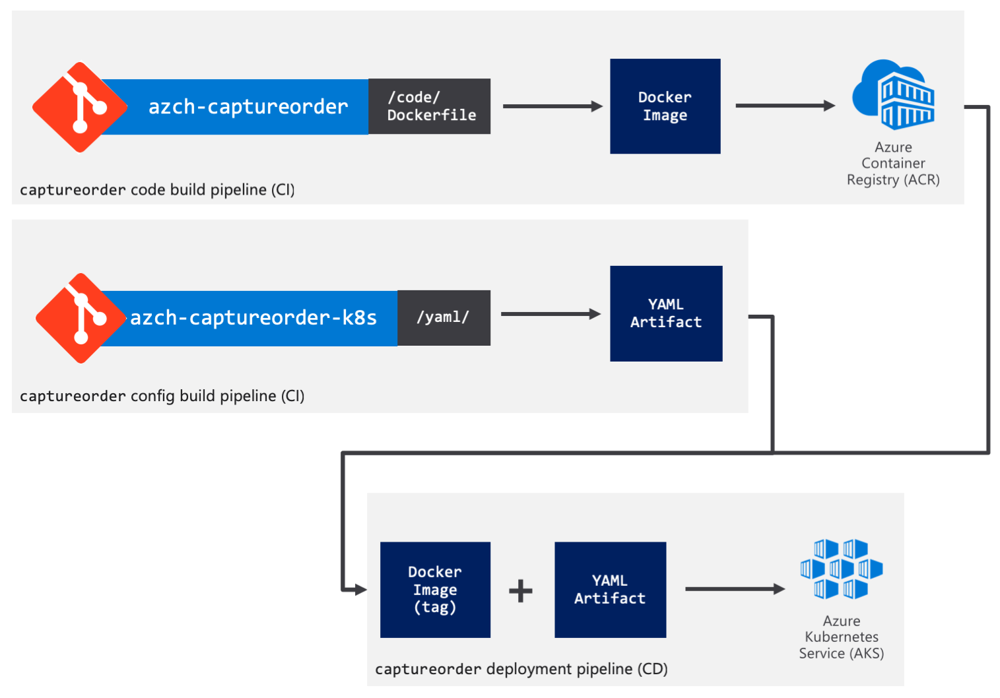

# Azure Kubernetes Workshop (Japanease Ver)

This is Japanease Version of the Azure Kubernetes Workshop, https://aksworkshop.io

<!-- TOC -->
- [Azure Kubernetes Workshop (Japanease Ver)](#azure-kubernetes-workshop-japanease-ver)
  - [1 The Azure Kubernetes Workshop](#1-the-azure-kubernetes-workshop)
    - [1.1 Prerequisites](#11-prerequisites)
    - [1.2 Kubernetes basics](#12-kubernetes-basics)
    - [1.3 Application Overview](#13-application-overview)
    - [1.4 Scoring](#14-scoring)
    - [1.5 Tasks](#15-tasks)
  - [2 Getting up and running](#2-getting-up-and-running)
    - [2.1 Deploy Kubernetes with Azure Kubernetes Service (AKS)](#21-deploy-kubernetes-with-azure-kubernetes-service-aks)
    - [2.2 Deploy MongoDB](#22-deploy-mongodb)
    - [2.3 Deploy the Order Capture API](#23-deploy-the-order-capture-api)
    - [2.4 Deploy the frontend using Ingress](#24-deploy-the-frontend-using-ingress)
    - [2.5 Monitoring](#25-monitoring)
    - [2.6 Scaling](#26-scaling)
    - [2.7 Create private highly available container registry](#27-create-private-highly-available-container-registry)
  - [3 DevOps tasks](#3-devops-tasks)
    - [3.1 Continuous Integration and Continuous Delivery](#31-continuous-integration-and-continuous-delivery)
    - [3.2 Package your app with Helm](#32-package-your-app-with-helm)


Azure Kubernetes Workshopへようこそ。 このワークショップでは、Azure Kubernetes Service（AKS）でアプリケーションをKubernetesに展開するために必要な基本的およびより高度なトピックを習得するのに役立つタスクを進めていきます。

## 1 The Azure Kubernetes Workshop
### 1.1 Prerequisites

**Tools**

ご自分の個人マシンで本ワークションのタスクを実行する場合は下記のツールが必要になります

| Tool	| URL |
| ------------- | ------------- |
| Azure CLI| https://docs.microsoft.com/en-us/cli/azure/install-azure-cli?view=azure-cli-latest |
| Git | https://git-scm.com/downloads |
| Docker | https://docs.docker.com/install/#supported-platforms |

> **NOTE** ご自分のAzureサブスクリプションでログイン後にAzure Cloud Shell (https://shell.azure.com)でタスクを進めることも可能です。Azure Cloud ShellにはAzure CLIやgitがプリインストールされてます。


**Azure Subscription**

ご自分のユーザ名とパスワードでAzureサブスクリプションにログインください - https://portal.azure.com。
また、ご自分のマシンでタスクを実行される人は、ご自分のマシンで下記コマンドを実行してAzure CLIコマンドの認証を行ってください。
```
az login
```

### 1.2 Kubernetes basics

このワークショップは事前にKubernetesの基礎やコンセプトを習得していることを前提としています。
次のドキュメントに目を通して、Kubernetesの仕組みや基本概念をご確認ください。
- Kubernetesを使い慣れていない方:  https://aka.ms/LearnAKS
- Kubernetesの経験がある開発者または管理者 - https://aka.ms/aks/bestpractices

### 1.3 Application Overview

顧客向けの発注および履行アプリケーションをデプロイしていきます。このアプリケーションはコンテナー化され、マイクロサービスアーキテクチャで設計されています。


アプリケーションは次の３つのコンポーネントで構成されています:
- 外向き注文受付、Order Capture API ( Swagger有効化 )
- 外向きフロントエンド
- MongoDBデータベース

### 1.4 Scoring
ワークショップに競争の要素を加えるために、あなたがデプロイするソリューションをリモートからの監視と客観的な性能評価の２点で評価します。ワークショップの終わりに勝者を発表します。 以下が評価ポイントになります。

- `Availability`: Application uptime over period of the workshop. We will be continuously making HTTP requests to your API. Availability monitoring using Azure Application Insights (https://docs.microsoft.com/en-us/azure/azure-monitor/app/monitor-web-app-availability) will be used.
    > Note Provide your proctor with the public endpoint of your captureorder service. The proctor will setup URL ping tests using Azure Application Insights to each team’s swagger endpoint, typically this would be something like http://<public endpoint>/swagger/.

- `Throughput`: Ability to cope with periodic load tests, through the maximum number of successful requests per second. These will be order submissions to http://<your endpoint>:80/v1/order/. We will be directing up to 6400 concurrent users to your application.
    > Refer to [the scaling section for guidance on how to run the load test](#26-scaling).
- `Extra tasks`: There will be a list of extra tasks, intermediate and advanced level. Each task, successfully accomplished, counts for extra bonus points.
- `Team`: You should have been provided a team name. If not, come up with a unique name and make sure to set it in the enviornment variables to be able to properly track your progress.

### 1.5 Tasks

各タスクにおいて作業を進める上で参考になる情報を提供します。チームですすめる場合は円滑に進められるように作業を分担ください。この場合、後の作業で必要になる可能性のある作業を予測して進めることが必要になるかもしれません。
> もし作業に詰まったら、プロクターに助けを求めてください

- `Core Tasks`: 少なくとも[2 Getting up and running](#2-getting-up-and-running)は完了できることを目指してください。これには、Kubernetesクラスタの設定、Docker Hubからのアプリケーションコンテナのデプロイ、アプリケーションの監視の設定およびアプリケーションのスケール設定が含まれます 
- `DevOps tasks`: 上記の作業が完了したら、次に[3 DevOps tasks](#3-devops-tasks)を進めてください。できるだけ多くのタスクを完了してください。 アプリケーションに継続的インテグレーションと継続的デリバリのパイプラインを設定し、Helmを使用してそれをデプロイします。
- `Advanced cluster tasks`(Coming soon): それができたら、AKSクラスターを仮想ノード(`Virtual Node`)で構成し、`Terraform`を使用してAKSやアプリケーションのデプロイ、MongoDBレプリケーションの設定を行います。 

## 2 Getting up and running

### 2.1 Deploy Kubernetes with Azure Kubernetes Service (AKS)

AKS (Azure Kubernetes Service)はAzureにおけるマネージドKubernetesサービスです。
AKSで有効な最新バージョンのKubernetesをデプロイしてください。

> ヒント: `Kubernetes Role-based access control（RBAC）`を有効にすると、クラスター作成後にクラスターリソースへのアクセス制限をきめ細かく制御できます。クラスター作成後にRBACを有効にすることはできません。RBAC対応クラスターでは、デフォルトでKubernetes Dashboard機能に制限がかかっています。 これは意図しない権限関連のエスカレーションを回避できるので良いセキュリティプラクティスであると言えます。

**Task: Azure CLIまたはポータルを使ってAKSで有効な最新バージョンのKubernetesをAzureにデプロイしてください**

リソースグループを作成
```bash
region=<targeted AKS region>
resource_group=<Resource Group>
az group create --name $resource_group --location $region
```

最新のKubernetesバージョンを取得
```bash
az aks get-versions -l $region -o table
kubernetesVersionLatest=$(az aks get-versions -l ${region} --query 'orchestrators[-1].orchestratorVersion' -o tsv)
```

AKSクラスターの作成
```bash
az aks create --resource-group $resource_group --name $cluster_name --enable-addons monitoring --kubernetes-version $kubernetesVersionLatest --generate-ssh-keys --location $region
```

> 重要: もしService Principal認証をお使いの場合は、クラスタ作成コマンドは次のように`Application Id`と`Application Secret Key`を渡して作成することになります。
>    ```bash
>    az aks create --resource-group $resource_group --name $cluster_name  --enable-addons monitoring --kubernetes-version $kubernetesVersionLatest --generate-ssh-keys --location $region --service-principal "APP_ID" --client-secret "APP_SECRET"
>    ```

Kubernetes CLI(kubectl)のインストール 
```bash
az aks install-cli
```
> Note: Azure Cloud Shellを利用する場合は既にkubectlはインストール済みであるため不要です


**Task: kubectlでクラスタにアクセスできることを確認してください**

```bash
az aks get-credentials --resource-group $resource_group --name $cluster_name
```

AKSクラスターのノード一覧を取得
```bash
kubectl get nodes

NAME                       STATUS   ROLES   AGE     VERSION
aks-nodepool1-23053049-0   Ready    agent   4m33s   v1.12.7
aks-nodepool1-23053049-1   Ready    agent   4m34s   v1.12.7
aks-nodepool1-23053049-2   Ready    agent   4m32s   v1.12.7
```


> 参考資料
> - https://docs.microsoft.com/ja-jp/azure/aks/kubernetes-walkthrough
> - https://docs.microsoft.com/ja-jp/cli/azure/aks?view=azure-cli-latest#az-aks-create
> - https://docs.microsoft.com/ja-jp/azure/aks/kubernetes-walkthrough-portal

### 2.2 Deploy MongoDB

MongoDBをデプロイします

> ヒント
> - MongoDBを作成するときに認証設定に注意してください。 スタンドアロンのユーザー名/パスワードとデータベースを作成することをお勧めします。
> - **重要**：Helmを使用してインストールしてからリリースを削除した場合、MongoDBのデータと構成は永続的ボリューム要求(Persistent Volume Claims)に保持されます。 認証設定が一致しないため、同じリリース名を使用して再デプロイすると問題が発生する可能性があります。 Helmの展開を削除して最初からやり直す必要がある場合は、作成されたPersistent Volume Claimsを必ず削除するようにしてください。そうしないと、古い設定が原因で認証に問題が発生します。 kubectl get pvcを使用してそれらのClaimsを見つけてください。


**Tasks: MongoDBインスタンスをクラスタにデプロイしてください。データベース名はakschallengeにしてください**

`Helm`を使ったMongoDBのデプロイメントを推奨します。HelmはKubernetesアプリケーションパッケージマネージャで`Helm Chart`はそのパッケージにあたります。Helmにはレプリケーションされ水平方向にスケール可能なMongoDB Helm Chartがあます。

個人マシンにHelmをインストールしてください。インストールはこちらの手順を参考にしてください https://docs.helm.sh/using_helm/#from-the-binary-releases

> Note: Azure Cloud Shellを利用する場合は既にHelmはインストール済みであるため不要です

RBACが有効化されたクラスタ（DefaultでクラスタはRBAC有効化されている）では、`Tiller`(Helmのサーバーサイドコンポーネント)に対する適切なServiceAccountを作成する必要があります

次のYAMLを`helm-rbac.yaml`という名前で保存ください。もしくは[helm-rbac.yaml](https://aksworkshop.io/yaml-solutions/01.%20challenge-02/helm-rbac.yaml)をダウンロードしてください
```YAML
apiVersion: v1
kind: ServiceAccount
metadata:
  name: tiller
  namespace: kube-system
---
apiVersion: rbac.authorization.k8s.io/v1
kind: ClusterRoleBinding
metadata:
  name: tiller
roleRef:
  apiGroup: rbac.authorization.k8s.io
  kind: ClusterRole
  name: cluster-admin
subjects:
  - kind: ServiceAccount
    name: tiller
    namespace: kube-system
```

次に、このYAMLを`kubectl`を使って適用してデプロイします
```bash
kubectl apply -f helm-rbac.yaml
```

`Tiller`を初期化します
```bash
helm init --service-account tiller


# Helm Client/Serverのバージョンが得られることを確認
helm version

Client: &version.Version{SemVer:"v2.13.0", GitCommit:"79d07943b03aea2b76c12644b4b54733bc5958d6", GitTreeState:"clean"}
Server: &version.Version{SemVer:"v2.13.0", GitCommit:"79d07943b03aea2b76c12644b4b54733bc5958d6", GitTreeState:"clean"}
```

最後に、`MongoDB Helm chart`をインストールします。 Tillerを初期化した後、しばらく待ってからMongoDB Chartをインストールしてから、作成したユーザー名、パスワード、およびエンドポイントをメモしてください。 以下のコマンドは`orders-user`という名前のユーザーと`orders-password`というパスワードで、`akschallenge`という名前のMongoDBデータベースを作成します。

```bash
helm install stable/mongodb --name orders-mongo --set mongodbUsername=orders-user,mongodbPassword=orders-password,mongodbDatabase=akschallenge
```

`helm ls`コマンドでHelm Chartがデプロイ(STATUS=`DEPLOYED`)されたことを確認する
```bash
helm ls

NAME            REVISION        UPDATED                         STATUS          CHART           APP VERSION     NAMESPACE
orders-mongo    1               Sun Apr 21 12:21:20 2019        DEPLOYED        mongodb-5.16.1  4.0.9           default
```

> 補足: デプロイされたMongoDBへのアクセス
```
MongoDB can be accessed via port 27017 on the following DNS name from within your cluster:

    orders-mongo-mongodb.default.svc.cluster.local

To get the root password run:

    export MONGODB_ROOT_PASSWORD=$(kubectl get secret --namespace default orders-mongo-mongodb -o jsonpath="{.data.mongodb-root-password}" | base64 --decode)

To get the password for "orders-user" run:

    export MONGODB_PASSWORD=$(kubectl get secret --namespace default orders-mongo-mongodb -o jsonpath="{.data.mongodb-password}" | base64 --decode)

To connect to your database run the following command:

    kubectl run --namespace default orders-mongo-mongodb-client --rm --tty -i --restart='Never' --image bitnami/mongodb --command -- mongo admin --host orders-mongo-mongodb --authenticationDatabase admin -u root -p $MONGODB_ROOT_PASSWORD

To connect to your database from outside the cluster execute the following commands:

    kubectl port-forward --namespace default svc/orders-mongo-mongodb 27017:27017 &
    mongo --host 127.0.0.1 --authenticationDatabase admin -p $MONGODB_ROOT_PASSWORD
```

> 参考資料
> - https://docs.microsoft.com/ja-jp/azure/aks/kubernetes-helm
> - https://github.com/helm/charts/tree/master/stable/mongodb#replication


### 2.3 Deploy the Order Capture API

Order Capture API ([azch/captureorder](https://hub.docker.com/r/azch/captureorder/)) をデプロイします。このAPIは外向けのエンドポイント（Port 80）を必要とし、MongoDBに書き込みを行います。

**コンテナイメージとソース**

|Component | Docker Image | Source Code | Build Status |
| ------------- | ------------- | ------------- | ------------- |
| Order Capture API | [azch/captureorder](https://hub.docker.com/r/azch/captureorder/) |[source-code](https://github.com/Azure/azch-captureorder) | |

**環境変数**

Order Capture APIは正しい動作ならびにあなたの進行状況をトラックするためにいくつか環境変数を設定していただく必要があります。コンテナアプリケーションに下記環境変数を設定するようにしてください。

- `TEAMNAME`="[あなたのチーム名もしくはあたなの名前]"
  - 進行状況のトラックのために利用します
- `CHALLENGEAPPINSIGHTS_KEY`="[AsSpecifiedAtTheEvent]"
  - プロクターが提供するApplication InsightsのKey。これも進行状況のトラックのために利用します。もしプロクターから提供されない場合は設定不要です。
- `MONGOHOST`="<hostname of mongodb>"
  - MongoDB ホスト名
- `MONGOUSER`="<mongodb username>"
  - MongoDB ユーザ名
- `MONGOPASSWORD`="<mongodb password>"
  - MongoDB パスワード

> [NOTE] Order Capture APIはヘルスチェック用に次のエンドポイントを公開します: `http://[PublicEndpoint]:[port]/healthz`

**Task: captureorder deploymentをプロビジョンしてpublicエンドポイントを公開してください**

次のYAMLを`captureorder-deployment.yaml`という名前で保存するか、もしくは[captureorder-deployment.yaml](https://aksworkshop.io/yaml-solutions/01.%20challenge-02/captureorder-deployment.yaml)からダウンロードしてください

```YAML
apiVersion: apps/v1
kind: Deployment
metadata:
  name: captureorder
spec:
  selector:
      matchLabels:
        app: captureorder
  replicas: 2
  template:
      metadata:
        labels:
            app: captureorder
      spec:
        containers:
        - name: captureorder
          image: azch/captureorder
          imagePullPolicy: Always
          readinessProbe:
            httpGet:
              port: 8080
              path: /healthz
          livenessProbe:
            httpGet:
              port: 8080
              path: /healthz
          resources:
            requests:
              memory: "128Mi"
              cpu: "100m"
            limits:
              memory: "256Mi"
              cpu: "500m"
          env:
          - name: TEAMNAME
            value: "team-azch"
          #- name: CHALLENGEAPPINSIGHTS_KEY # uncomment and set value only if you've been provided a key
          #  value: "" # uncomment and set value only if you've been provided a key
          - name: MONGOHOST
            value: "orders-mongo-mongodb.default.svc.cluster.local"
          - name: MONGOUSER
            value: "orders-user"
          - name: MONGOPASSWORD
            value: "orders-password"
          ports:
          - containerPort: 8080
```

このYAMLをkubectlを使ってデプロイします
```bash
kubectl apply -f captureorder-deployment.yaml
```

デプロイしたPodがRunningであることを確認します

```bash
kubectl get pods -l app=captureorder

NAME                            READY   STATUS    RESTARTS   AGE
captureorder-655569c77b-9nzjd   1/1     Running   0          <invalid>
captureorder-655569c77b-xgmm4   1/1     Running   0          <invalid>
```

> ヒント: もしPodsが開始されない、NOT Readyである、もしくはクラッシュなどしている場合、`kubectl logs <pod name>`や`kubectl describe pod <pod name>`のようなコマンドで出力されているログを見ることができます


続いて、次のYAMLをcaptureorder-service.yamlという名前で保存するか、もしくは[captureorder-service.yaml](https://aksworkshop.io/yaml-solutions/01.%20challenge-02/captureorder-service.yaml)からダウンロードください。
```YAML
apiVersion: v1
kind: Service
metadata:
  name: captureorder
spec:
  selector:
    app: captureorder
  ports:
  - protocol: TCP
    port: 80
    targetPort: 8080
  type: LoadBalancer
```

kubectlを使ってServiceをデプロイします
```
kubectl apply -f captureorder-service.yaml
```

外部アクセス用IPアドレスを取得してください。`Azure Load Balancer`がパブリックIPを割り当てるまでに数分かかることがあります。ご注意ください。
```
# Service一覧を取得
kubectl get svc

NAME                   TYPE           CLUSTER-IP     EXTERNAL-IP     PORT(S)        AGE
captureorder           LoadBalancer   10.0.232.244   40.115.244.40   80:30707/TCP   2m46s     <<<<
kubernetes             ClusterIP      10.0.0.1       <none>          443/TCP        96m
orders-mongo-mongodb   ClusterIP      10.0.138.98    <none>          27017/TCP      55m

# Service名captureorderのEXTERNAL-IPのみを取得
    kubectl get service captureorder -o jsonpath="{.status.loadBalancer.ingress[*].ip}"
```

**Task: 注文が問題なくMongoDBに書き込まれていることを確認ください**

`curl`や`Postman`などを使って`captureorder` ServiceにPOSTリクエストを投げてください。
```bash
curl -d '{"EmailAddress": "email@domain.com", "Product": "prod-1", "Total": 100}' -H "Content-Type: application/json" -X POST http://[Your Service Public LoadBalancer IP]/v1/order
```
次のような注文IDが返却されるはずです
```
{
    "orderId": "5beaa09a055ed200016e582f"
}
```

> 参考資料
> - https://kubernetes.io/docs/concepts/workloads/controllers/deployment/
> - https://kubernetes.io/docs/concepts/services-networking/service/


### 2.4 Deploy the frontend using Ingress

ここではFrontend ([azch/frontend](https://hub.docker.com/r/azch/frontend/)) をデプロイします。Frontendは外向けのエンドポイント（Port 80）を必要とし、Order Capture APIのPublicエンドポイントに対してリクエストを送ります。

**コンテナイメージとソース**

|Component | Docker Image | Source Code | Build Status |
| ------------- | ------------- | ------------- | ------------- |
| Frontend | [azch/frontend](https://hub.docker.com/r/azch/frontend/) |[source-code](https://github.com/Azure/azch-frontend) | |

**環境変数**

Frontendは正しく動作するために環境変数を設定していただく必要があります。コンテナアプリケーションに下記環境変数を設定するようにしてください。

- `CAPTUREORDERSERVICEIP`="<public IP of order capture service>"

**Task: Provision the frontend deployment**

次のYAMLを`frontend-deployment.yaml`という名前で保存するか、もしくは[frontend-deployment.yaml](https://aksworkshop.io/yaml-solutions/01.%20challenge-02/frontend-deployment.yaml)からダウンロードしてください
```YAML
apiVersion: apps/v1
kind: Deployment
metadata:
  name: frontend
spec:
  selector:
      matchLabels:
        app: frontend
  replicas: 1
  template:
      metadata:
        labels:
            app: frontend
      spec:
        containers:
        - name: frontend
          image: azch/frontend
          imagePullPolicy: Always
          readinessProbe:
            httpGet:
              port: 8080
              path: /
          livenessProbe:
            httpGet:
              port: 8080
              path: /
          resources:
            requests:
              memory: "128Mi"
              cpu: "100m"
            limits:
              memory: "256Mi"
              cpu: "500m"
          env:
          - name: CAPTUREORDERSERVICEIP
            value: "<public IP of order capture service>"
          ports:
          - containerPort: 8080
```

YAMLに正しい`CAPTUREORDERSERVICEIP`の値の設定ができたらkubectlを使ってデプロイします
```
kubectl apply -f frontend-deployment.yaml
```

デプロイしたPodがRunningであることを確認します
```
kubectl get pods -l app=frontend

NAME                        READY   STATUS    RESTARTS   AGE
frontend-5cd47b4d4b-n8qbs   0/1     Running   0          19s
```

> ヒント: もしPodsが開始されない、NOT Readyである、もしくはクラッシュなどしている場合、`kubectl logs <pod name>`や`kubectl describe pod <pod name>`のようなコマンドで出力されているログを見ることができます


**Task: frontendをホスト名で公開してください**

IPアドレスではなくホスト名を介してフロントエンドを公開します。 このために、`AKS HTTP Application Routing`アドオンと共に`Kubernetes Ingress`を使用してください。

このアドオンの有効化では次の２つのコンポーネントがデプロイされます:
- `Ingress controller`: Ingress Controllerは、`LoadBalancer`タイプのKubernetesサービスを使用してインターネットに公開されます。 Ingress Controllerは、Kubernetes Ingressリソースを監視し、実装を行い、これによりアプリケーションのエンドポイントへのルートが作成（ルーティングが設定）されます。
- `External-DNS controller`: Kubernetes Ingressリソースを監視し、Azure DNSを使用してクラスター固有のDNSゾーンにDNS Aレコードを作成します。.

HTTP routingアドオンを有効化してください。完了するまで数分かかる可能性があります。

```bash
az aks enable-addons --resource-group $resource_group --name $cluster_name --addons http_application_routing
```

Serviceの設定を行います。
次のYAMLを`frontend-service.yaml`という名前で保存するか、もしくは[frontend-service.yaml](https://aksworkshop.io/yaml-solutions/01.%20challenge-02/frontend-service.yaml)からダウンロードしてください

> Note: Ingressを使用してデプロイメントを公開するので、サービスにパブリックIPを使用する必要はありません。したがって、サービスの種類を`LoadBalancer`ではなく`ClusterIP`に設定します

```YAML
apiVersion: v1
kind: Service
metadata:
  name: frontend
spec:
  selector:
    app: frontend
  ports:
  - protocol: TCP
    port: 80
    targetPort: 8080
  type: ClusterIP
```

kubectlを使ってserviceをデプロイします
```bash
kubectl apply -f frontend-service.yaml
```

Ingressの設定を行います。 HTTP Application routingアドオンはIngressリソースが次のようにアノテーション設定されている場合にトリガーされます

```YAML
annotations:
  kubernetes.io/ingress.class: addon-http-application-routing
```

以下のコマンドを実行して、クラスタ固有のDNSゾーン名を取得してください
```
az aks show --resource-group akschallenge --name $cluster_name --query addonProfiles.httpApplicationRouting.config.HTTPApplicationRoutingZoneName -o table


Result
----------------------------------------
9f9c1fe7-21a1-416d-99cd-3543bb92e4c3.eastus.aksapp.io
```

`9f9c1fe7-21a1-416d-99cd-3543bb92e4c3.eastus.aksapp.io`のような結果が取得できます。 これがクラスタ固有のDNSゾーンになります。

次に、 必要なアノテーションを付けたIngressリソースを作成し、`<CLUSTER_SPECIFIC_DNS_ZONE>`を前のコマンドで取得したDNSゾーン名で置き換えてください。

次のYAMLを`frontend-ingress.yaml`という名前で保存するか、もしくは[frontend-ingress.yaml](https://aksworkshop.io/yaml-solutions/01.%20challenge-02/frontend-ingress.yaml)からダウンロードしてください

```YAML
apiVersion: extensions/v1beta1
kind: Ingress
metadata:
  name: frontend
  annotations:
    kubernetes.io/ingress.class: addon-http-application-routing
spec:
  rules:
  - host: frontend.<CLUSTER_SPECIFIC_DNS_ZONE>
    http:
      paths:
      - backend:
          serviceName: frontend
          servicePort: 80
        path: /
```

`kubectl`でIngressをデプロイします
```
kubectl apply -f frontend-ingress.yaml
```

DNSレコードが問題なく作成されたことを確認していきます。 `kubectl logs`コマンドで外向けDNS Podのログを参照します。
```
kubectl logs -f deploy/addon-http-application-routing-external-dns -n kube-system
```

Aレコードの更新に関する何らかのログが出力されるはずです。出力されるまでに数分かかることがあります。
```
time="2019-02-13T01:58:25Z" level=info msg="Updating A record named 'frontend' to '13.90.199.8' for Azure DNS zone 'b3ec7d3966874de389ba.eastus.aksapp.io'."
time="2019-02-13T01:58:26Z" level=info msg="Updating TXT record named 'frontend' to '"heritage=external-dns,external-dns/owner=default"' for Azure DNS zone 'b3ec7d3966874de389ba.eastus.aksapp.io'."
```

また、あなたのクラスタ用のAzure DNS Zoneに新しいレコードが追加されたことを確認することができるはずです。


最後に、frontend用の外向けDNS名でアクセスしてみてください。
Ingressがデプロイされ、DNSレコードが伝搬されたら、次のURLでfrontendにアクセスできるようになります - http://frontend.[cluster_specific_dns_zone], 例えば http://frontend.9f9c1fe7-21a1-416d-99cd-3543bb92e4c3.eastus.aksapp.io

もし最初のアクセスでうまく表示されない場合は、数分待つか、別のブラウザでお試しください。


> 参考資料
> - https://kubernetes.io/docs/concepts/workloads/controllers/deployment/
> - https://kubernetes.io/docs/concepts/services-networking/service/


### 2.5 Monitoring

アプリケーションの可用性が低下したり、一部のコンポーネントに障害が発生したりした場合、アプリケーション内のさまざまなコンポーネントのパフォーマンスを監視し、ログを表示してアラートを取得したいと思うはずです。

ここでは使用可能なツールを組み合わせて、アプリケーションのためのアラート設定を行います。

**Tasks: AKSに統合された監視機能を活用して、リクエストが失敗したかどうかを判断し、ログを調べてクラスターの状態を監視してください**

もしAKSクラスタ作成時に監視機能を有効化していない場合は、次のコマンドで有効化することができます
```
az aks enable-addons --resource-group $resource_group --name $cluster_name --addons monitoring
```

それでは監視機能が有効化されていると仮定して、クラスタのutilizationを確認してください


問題が発生しているPodsを特定してください


**Task: コンテナのライブログを閲覧してください**

RBACが有効化されたクラスタ（デフォルトRBAC有効化される）の場合、適切な`ClusterRole`と`ClusterRoleBinding`を作成する必要があります

次のYAMLを`logreader-rbac.yaml`という名前で保存するか[logreader-rbac.yaml](https://aksworkshop.io/yaml-solutions/01.%20challenge-03/logreader-rbac.yaml)よりダウンロードしてください

```YAML
apiVersion: rbac.authorization.k8s.io/v1
kind: ClusterRole
metadata:
   name: containerHealth-log-reader
rules:
   - apiGroups: [""]
     resources: ["pods/log"]
     verbs: ["get"]
---
apiVersion: rbac.authorization.k8s.io/v1
kind: ClusterRoleBinding
metadata:
   name: containerHealth-read-logs-global
roleRef:
  kind: ClusterRole
  name: containerHealth-log-reader
  apiGroup: rbac.authorization.k8s.io
subjects:
   - kind: User
     name: clusterUser
     apiGroup: rbac.authorization.k8s.io
```

これを`kubectl`でデプロイしてください
```bash
kubectl apply -f logreader-rbac.yaml
```

ライブログ機能はKubernetes認証でkube-apiを使用するため、読み取り専用権限が必要となります。ただしKubernetes RBAC有効化されていない、またはAzure ADシングルサインオンと統合されていないクラスタの場合は、上記の手順を行う必要はありません。 

AzureポータルのAKSクラスターに移動し、`監視(Monitoring)`の下の`インサイト(Insights)`をクリックし、`コンテナー(Containers)`タブをクリックしてコンテナーを選択してライブログを表示し、進行中の情報をデバッグします。


> 参考資料
- https://docs.microsoft.com/ja-jp/azure/application-insights/app-insights-alerts
- https://docs.microsoft.com/ja-jp/azure/azure-monitor/insights/container-insights-live-logs
- https://docs.microsoft.com/ja-jp/azure/azure-monitor/insights/container-insights-overview
- https://coreos.com/operators/prometheus/docs/latest/


### 2.6 Scaling

アプリケーションの人気が高まるにつれて、需要の変化に応じてアプリケーションの要件を適切に調整する必要があります。 注文送信数が増加してもアプリケーションが応答し続けるようにしてください

**Task: ベースラインの負荷テストを実行してください**

Docker Hub（[azch/loadtest](https://hub.docker.com/r/azch/loadtest)）に負荷テスト実行のために事前設定されたコンテナーイメージがあります。 以下のコマンドを実行して、[Azure Container Instances](https://azure.microsoft.com/en-us/services/container-instances/?wt.mc_id=aksworkshop)を実行してください

```bash
capture_order_service_ip="<public ip of order capture service>"

az container create -g $resource_group -n loadtest --image azch/loadtest --restart-policy Never -e SERVICE_IP=$capture_order_service_ip 
```

これにより一連の同時ユーザー数（100、400、1600、3200、6400人）によるOrder Capture APIエンドポイントへのPOSTリクエストの送信を行うことができ、アプリケーションへの負荷の増大をシミュレートすることができます。
以下のコマンドを実行して、Azure Container Instanceのストリーミングログを表示できます。 全てのログを取得するために数分待つ必要があるかもしれません

```bash
az container logs -g $resource_group -n loadtest
```

終わったら、次のコマンドで削除ください
```bash
az container delete -g $resource_group -n loadtest
```

Make note of results (sample below), figure out what is the breaking point for the number of users.
結果から（下記サンプル）、ユーザー数の限界点を見つけてください

```
Phase 5: Load test - 30 seconds, 6400 users.

Summary:
  Total:	41.1741 secs
  Slowest:	23.7166 secs
  Fastest:	0.8882 secs
  Average:	9.7952 secs
  Requests/sec:	569.1929

  Total data:	1003620 bytes
  Size/request:	43 bytes

Response time histogram:
  0.888 [1]	|
  3.171 [1669]	|■■■■■■■■■■■■■■
  5.454 [1967]	|■■■■■■■■■■■■■■■■■
  7.737 [4741]	|■■■■■■■■■■■■■■■■■■■■■■■■■■■■■■■■■■■■■■■■
  10.020 [3660]	|■■■■■■■■■■■■■■■■■■■■■■■■■■■■■■■
  12.302 [3786]	|■■■■■■■■■■■■■■■■■■■■■■■■■■■■■■■■
  14.585 [4189]	|■■■■■■■■■■■■■■■■■■■■■■■■■■■■■■■■■■■
  16.868 [2583]	|■■■■■■■■■■■■■■■■■■■■■■
  19.151 [586]	|■■■■■
  21.434 [151]	|■
  23.717 [7]	|

Status code distribution:
  [200]	23340 responses

Error distribution:
  [96]	Post http://23.96.91.35/v1/order: net/http: request canceled (Client.Timeout exceeded while awaiting headers)
```

**Task: Horizontal Pod Autoscaler(HPA) を作成してください**

最初のテストではcaptureorderコンテナがボトルネックだった可能性が高いと思います。したがって、最初のステップとしてそれをスケールアウトすることが必要かと思います。これには2つの方法があります。クラスタ内のレプリカ数を手動で増やすか、またはHorizontal Pod Autoscalerを使ったオートスケールになります。

HPAにより、Kubernetesに展開したPodにさらに多くのリソースが必要になったことが検出されると、その要求に対応するためにクラスターに追加のPodがスケジュールされます。

次のYAMLをcaptureorder-hpa.yamlという名前で保存するか、[captureorder-hpa.yaml](https://aksworkshop.io/yaml-solutions/01.%20challenge-04/captureorder-hpa.yaml)よりダウンロードください。

```YAML
apiVersion: autoscaling/v1
kind: HorizontalPodAutoscaler
metadata:
  name: captureorder
spec:
  scaleTargetRef:
    apiVersion: apps/v1
    kind: Deployment
    name: captureorder
  minReplicas: 4
  maxReplicas: 10
  targetCPUUtilizationPercentage: 50
```

これを`kubectl`でデプロイしてください

```
kubectl apply -f captureorder-hpa.yaml
```

次のコマンドでHPAのステータスを取得してください
```bash
kubectl get hpa captureorder

NAME           REFERENCE                 TARGETS   MINPODS   MAXPODS   REPLICAS   AGE
captureorder   Deployment/captureorder   0%/50%    4         10        4          7m17s
```

**Task: HPA作成後に再び負荷テストを実行してください**

もし先ほど作成した負荷テスト用Azure Container Instanceをまだ削除していない場合は先にそれを削除してください
```bash
az container delete -g $resource_group -n loadtest
```

そして、再び負荷テストを実行してください
```
capture_order_service_ip="<public ip of order capture service>"

az container create -g $resource_group -n loadtest --image azch/loadtest --restart-policy Never -e SERVICE_IP=$capture_order_service_ip 
```

次のコマンドでクラスタがどうのように反応するか観察してみてください
```bash
# HPAステータス
kubectl get hpa captureorder -w

NAME           REFERENCE                 TARGETS   MINPODS   MAXPODS   REPLICAS   AGE
captureorder   Deployment/captureorder   0%/50%    4         10        4          12m
captureorder   Deployment/captureorder   8%/50%    4         10        4          14m
captureorder   Deployment/captureorder   319%/50%   4         10        4          15m
captureorder   Deployment/captureorder   319%/50%   4         10        8          15m
captureorder   Deployment/captureorder   319%/50%   4         10        10         15m
captureorder   Deployment/captureorder   136%/50%   4         10        10         16m

# Pod一覧
kubectl get pod -l app=captureorder -w

captureorder-655569c77b-7nc58   0/1     ContainerCreating   0          <invalid>
captureorder-655569c77b-g6wbf   0/1     ContainerCreating   0          <invalid>
captureorder-655569c77b-pndwm   0/1     ContainerCreating   0          <invalid>
captureorder-655569c77b-g6wbf   0/1     Running             0          <invalid>
captureorder-655569c77b-q77zx   0/1     Running             0          <invalid>
captureorder-655569c77b-7nc58   0/1     Running             0          <invalid>
captureorder-655569c77b-pndwm   0/1     Running             0          <invalid>
captureorder-655569c77b-pndwm   1/1     Running             0          <invalid>
captureorder-655569c77b-g6wbf   1/1     Running             0          <invalid>
captureorder-655569c77b-7nc58   1/1     Running             0          <invalid>
captureorder-655569c77b-q77zx   1/1     Running             0          <invalid>
captureorder-655569c77b-7bxv9   0/1     Pending             0          <invalid>
captureorder-655569c77b-7bxv9   0/1     Pending             0          <invalid>
captureorder-655569c77b-p6254   0/1     Pending             0          <invalid>
captureorder-655569c77b-p6254   0/1     Pending             0          <invalid>
captureorder-655569c77b-7bxv9   0/1     ContainerCreating   0          <invalid>
captureorder-655569c77b-p6254   0/1     ContainerCreating   0          <invalid>
captureorder-655569c77b-7bxv9   0/1     Running             0          <invalid>
```

> 参考: 負荷テストのデモ動画
> - https://aksworkshop.io/media/autoscale-in-action.mp4


**Task: クラスタのノード数を手動もしくはオートスケールさせる**

Scale the cluster nodes using the command below to the required number of nodes
以下のコマンドを使用して、手動でクラスタノード数をスケールさせます。

```bash
az aks scale --resource-group $resource_group --name $cluster_name --node-count 4
```

(オプショナルタスク) AKS cluster-autoscalerでクラスタのノード数をオートスケール設定させることも可能
- https://docs.microsoft.com/en-us/azure/aks/autoscaler.


> 参考資料
> - https://docs.microsoft.com/ja-jp/azure/aks/tutorial-kubernetes-scale
> - https://docs.microsoft.com/ja-jp/azure/aks/autoscaler
> - https://docs.microsoft.com/ja-jp/vsts/load-test/get-started-simple-cloud-load-test

### 2.7 Create private highly available container registry

パブリックなDocker Hubレジストリを使用する代わりに、Azure Container Registry（ACR）を使用して独自のプライベートコンテナレジストリを作成してください。

**Task:Azure Container Registry (ACR)を作成してください **
```bash
az acr create --resource-group $resource_group --name $acr_name --sku Standard --location $region
```
**Task: Azure Container Registry Build機能を使ってコンテナイメージをあなたが作成したレジストリにPushしてください**

まずはレジストリにログインしてください　

```bash
az acr login --name $acr_name
```

アプリケーションのコードをGit Cloneしてください
```bash
git clone https://github.com/Azure/azch-captureorder.git
cd azch-captureorder
```

`Azure Container Registry Build`機能を使ってコンテナイメージをビルドしてレジストリにPushしてください

```bash
az acr build -t "captureorder:{{.Run.ID}}" -r $acr_name .
```
> NOTE: 最後に下記の似たようなメッセージが表示され、その中のBuild IDを取得ください。この例でいうと`ca3`を次のステップでイメージタグとしてご利用ください
> ```
> Run ID: ca3 was successful after 3m14s
> ```


**Task: アプリケーションをプライベートレジストリからPULLするように設定してください**

プライベートレジストリに保存されたイメージを使う前に、あなたのKubernetesクラスタがレジストリにアクセスできるように設定する必要があります。これには２つの方法があります。どちらか１つを選択ください。
- 1. AKSが作成したService PrincipalにACRへのアクセス権限を付与する
- 2. Kubernetes Secretを作成する

**(1) AKSが作成したService PrincipalにACRへのアクセス権限を付与する方法**

AKSが生成したサービスプリンシパルを使用して、AKSクラスターにACRへのアクセスを承認してください。

Azure AD Service Principalを使用したアクセス許可設定方法については、[Azureのドキュメント](https://docs.microsoft.com/ja-jp/azure/container-registry/container-registry-auth-aks?wt.mc_id=aksworkshop)を参照ください。

```bash
aks_resource_group="<AKS Resource Group>"
acr_resource_group="<ACR Resource Group>"
cluster_name="AKS Cluster Name"
acr_name="ACR Name"

# Get the id of the service principal configured for AKS
CLIENT_ID=$(az aks show --resource-group $aks_resource_group --name $cluster_name --query "servicePrincipalProfile.clientId" --output tsv)

# Get the ACR registry resource id
ACR_ID=$(az acr show --name $acr_name --resource-group $acr_resource_group --query "id" --output tsv)

# Create role assignment
az role assignment create --assignee $CLIENT_ID --role acrpull --scope $ACR_ID
```

**(2) Kubernetes Secretを作成する方法**

次のコマンドで新しいサービスプリンシパルを作成してください。 

```bash
acr_name="ACR Name"
service_principal_name="acr-service-principal"

# Populate the ACR login server and resource id.
ACR_LOGIN_SERVER=$(az acr show --name $acr_name --query loginServer --output tsv)
ACR_REGISTRY_ID=$(az acr show --name $acr_name --query id --output tsv)

# Create acrpull role assignment with a scope of the ACR resource.
SP_PASSWD=$(az ad sp create-for-rbac --name http://$service_principal_name --role acrpull --scopes $ACR_REGISTRY_ID --query password --output tsv)

# Get the service principal client id.
CLIENT_ID=$(az ad sp show --id http://$service_principal_name --query appId --output tsv)

# Output used when creating Kubernetes secret.
echo "Service principal ID: $CLIENT_ID"
echo "Service principal password: $SP_PASSWD"
```

このクレデンシャルをKubernetesの[image pull secret](https://kubernetes.io/docs/concepts/configuration/secret/#using-imagepullsecrets)に保存します。AKSクラスタはコンテナを走らせる時にこのimage pull secretを参照します。

次のkubectlコマンドを使用してKubernetesシークレットを作成します。 `acr-login-server`をAzureコンテナレジストリ（ "acrname.azurecr.io"の形式）に置き換えます。 その他、`docker-username`（サービスプリンシパルID）、`docker-password`（サービスプリンシパルパスワード）、および`docker-email`（メールアドレス）を指定ください。

```bash
acr_login_server=$ACR_LOGIN_SERVER
service_principal_id=$CLIENT_ID
service_principal_password=$SP_PASSWD
email_address="your email address"

kubectl create secret docker-registry acr-auth --docker-server $acr_login_server --docker-username $service_principal_id --docker-password $service_principal_password --docker-email $email_address
```

最後にdeploymentの設定を`imagePullSecrets`パラメータに上記で作成したsecret名(ここでは`acr-auth`)を指定するように更新ください

```YAML
spec:
  imagePullSecrets:
  - name: acr-auth
  containers:
```


上記(1)または(2)の方法でクラスタのACRレジストリへのアクセスの承認設定がされたら、先ほどACRでBuildしたコンテナイメージをPullするようにDeploymentの設定を更新ください。

Kubernetesは宣言型であり、すべてのオブジェクトリソースのマニフェストが保持されています。 更新されたイメージを使用してDeploymentオブジェクトを編集します。

```bash
kubectl edit deploy captureorder
```

image部分をAzure Container Registryの新しいイメージに置き換えます。 `<build id>`を、さきほどのBuild時のメッセージ（`Run ID: ca3 was successful after 3m14s`）で取得したIDに置き換えます (ここでは`ca3`)

```YAML
spec:
  containers:
  - name: captureorder
    image: <unique-acr-name>.azurecr.io/captureorder:<build id>
```

編集を終えたら次のコマンドでPodのステータスを確認ください
```
kubectl get pods
```

ACRレジストリへのアクセスが正常に許可されていれば、1つのPodが終了し、新しいPodが作成され、10秒以内には稼働しているはずです。


> 参考資料
> - https://docs.microsoft.com/en-us/azure/container-registry
> - https://docs.microsoft.com/en-us/azure/container-registry/container-registry-auth-aks
> - https://docs.microsoft.com/en-us/cli/azure/acr?view=azure-cli-latest#az-acr-build
> - https://github.com/MicrosoftDocs/azure-docs/blob/master/articles/container-registry/container-registry-auth-aks.md

## 3 DevOps tasks

### 3.1 Continuous Integration and Continuous Delivery

あなたの会社の開発チームはアプリケーションコードに多くの修正を加えるようになっており、手動で更新をデプロイしていくことは難しくなってきております。 
あなたは、コード変更をデプロイするためにCI/CDをサポートする堅牢なDevOpsパイプラインを作成する必要があります。

> ヒント:
> - GitHubのソースコードレジストリには、Azure Pipelinesを使ってコンテナーをビルドすることができる定義が書かれている`azure-pipelines.yml`がありま。 このパイプラインはDocker Hubにイメージをプッシュします。 `Azure Container Registry (ACR)`にプッシュするなど、何か別のことをしたい場合は、このファイルを少し編集していく必要があります。 JenkinsのようなCI/CDツールの中のやり方で組んでいくこともできます。
> - コンテナイメージのタグは`latest`を使用するのではなく、個別のビルドIDなのでタグを設定ください
> - ガイダンスとして下記のダイアグラムを使ってください.



ここではAzure DevOpsを使用してください 

**Task: Azure DevOpsアカウントを作成してください**

https://dev.azure.com に行って、あなたのAzure subscriptionのクレデンシャルでサインインください。
もし初めてのAzure DevOpsアカウントのプロビジョニングの場合は、簡単なウィザードに従って新しい組織を作成してください。


**Task: projectを作成してください**

`azch-captureorder`という名前の新しいプライベートプロジェクトを作成ください


**Task: GitHubのソースリポジトリをAzure Reposにインポートしてください**

`Repos`をクリックして`captureorder`サービスのソースコードを次のパブリックなGithubレポジトリからインポートしてください - http://github.com/Azure/azch-captureorder.git


**Task: アプリケーションコンテナのためのビルドパイプラインを作成してください**

以下のYAMLを`azure-pipelines.yml`として保存するか、または[azure-pipelines.captureorder.yml](https://aksworkshop.io/yaml-solutions/devops/azure-pipelines.captureorder.yml)からダウンロードして`azure-pipelines.yml`としてコードリポジトリ（`azch-captureorder`）に保存してください

このパイプラインはdocker build、docker login、docker pushを実行し、最新のBuildIdでイメージタグを作成します。

```YAML
pool:
  vmImage: 'Ubuntu 16.04'

variables:
  imageName: 'captureorder:$(Build.BuildId)'
  # define three more variables acrName, dockerId and dockerPassword in the build pipeline in UI

steps:
- script: docker build -f Dockerfile -t $(acrName).azurecr.io/$(imageName) .
  displayName: 'docker build'

- script: docker login -u $(dockerId) -p $(dockerPassword) $(acrName).azurecr.io
  displayName: 'docker login'

- script: docker push $(acrName).azurecr.io/$(imageName)
  displayName: 'docker push'
```


**Task: azch-captureorderのソースコードをDockerイメージにビルドして先ほど作成したACRにPushしてください**

YAMLパイプラインを使って`build`をセットアップします


パイプラインテンプレートとしてYAMLを選択ください


 ブラウズして先ほど作成したazure-pipelines.ymlのファイルを選択してください。また、Agentを`Hosted Ubuntu`に変更ください。


Web UIのビルドパイプラインの変数を定義ください
- `dockerId`: Azure Container Registryのadmin user名またはService Principal ID .
- `acrName`: Azure Container Registry名.
- `dockerPassword`: Azure Container RegistryのadminユーザパスワードまたはService Principalパスワード


> **ヒント**
> - Service Principal IDやパスワードを取得するために、またはACR Adminユーザーを有効化するために、次のページを参照ください 
>   - https://docs.microsoft.com/en-us/azure/container-registry/container-registry-auth-aks#access-with-kubernetes-secret 
> - これらの変数は`Pipeline Variable`としてよりも`Variable Group`として保存したほうがよいです。そうすることで複数パイプラインに渡ってこれら変数を再利用することができます

ビルドパイプラインを走らせて、その動作を確認ください


イメージが最終的にACRレジストリにPUSHされていることを確認ください


**Task: KubernetesのYAMLファイルを保持するための新しいAzure DevOpsレポジトリを作成してください（例えば名前は azch-captureorder-kubernetes で）**

別のリポジトリを作成しているのは、Kubernetesのdeployment定はdeployment artifactであり、コードからは独立しているためです。 新しいコンテナの構築を行わずに、コンテナのデプロイ方法、Kubernetesサービスの作成方法などを変更したい場合があります。 このため、別々のリポジトリを用意することは、これら懸念を分離することができ、推奨される方法といえます。

それでは、新しいリポジトリの作成に進んでください。新しいレポジトリはazch-captureorder-kubernetesとします。 `Initialize`ボタンをクリックしてREADME.mdファイルを作成し、.gitignoreファイルを追加してください。


新しいレポジトリで`yaml`フォルダを作成してそこにさきほど作成したサービス構築に必要なYAMLファイルを追加してください。


下記リンクからダウンロードすることもできます。必ず`azch-captureorder-kubernetes`レポジトリの`yaml`フォルダに保存するようにしてください。
- [captureorder-deployment.yaml](https://aksworkshop.io/yaml-solutions/devops/captureorder-deployment.yaml)
- [captureorder-service.yaml](https://aksworkshop.io/yaml-solutions/devops/captureorder-service.yaml)
- [captureorder-hpa.yaml](https://aksworkshop.io/yaml-solutions/devops/captureorder-hpa.yaml)
> **ヒント**
> - `captureorder-deployment.yaml`で気をつけないといけないこととして、イメージ名 `<unique-acr-name>.azurecr.io/captureorder:##BUILD_ID##`の変更が必要になることです。自分のACR名を入れてください。
> - `##BUILD_ID##`についてはリリースパイプラインで実際にデプロイされるバージョンで置換する設定を行います

**Task: Kubernetes設定ファイルのビルドパイプラインを作成してください**

下記YAMLを`azure-pipelines.yml`という名前で保存するか、または[azure-pipelines.captureorder-k8s.yml](https://aksworkshop.io/yaml-solutions/devops/azure-pipelines.captureorder-k8s.yml)からダウンロードしてKubernetes設定用レポジトリ(`azch-captureorder-kubernetes`)に`azure-pipelines.yml`という名前で保存してください。 

これは実際にはbuild artifactとしてyamlフォルダをコピーします。 Artifactは、後でクラスタへのデプロイのためのリリースパイプラインより取得されます。

```YAML
pool:
  vmImage: 'Ubuntu 16.04'

steps:
- task: PublishBuildArtifacts@1
  displayName: 'publish yaml folder as an artifact'
  inputs:
    artifactName: 'yaml'
    pathToPublish: 'yaml'
```

Dockerイメージビルドパイプラインと同じように、`azch-captureorder-kubernetes`レポジトリのYAMLパイプラインを使ったビルドパイプラインを設定してください。一旦保存したらbuild artifactとして`yaml`フォルダがコピーされることを確認ください。

**Task: 継続的デプロイメントパイプラインを作成してください**

`azch-captureorder-kubernetes`リポジトリにCDパイプラインを作成して、新しいコンテナイメージまたは新しいYAML設定artifactのいずれかをトリガーにその変更をクラスターにデプロイします。


利用しているAzureリソースグループを選択ください


EmptyテンプレートをベースにReleaseパイプラインを作成してください。 Azure Container Registry Artifactをトリガーとして追加し、継続的デプロイメントトリガーを有効にします。 ビルドパイプラインがcaptureorderイメージをPUSHしているAzure Container Registryリポジトリを指すように構成するようにしてください。


`azch-captureorder-kubernetes`パイプラインから発生する別のビルドArtifactをトリガーとして追加し、継続的デプロイメントトリガーを有効にします。 これはYAML設定の変更のトリガーになります。

> **ヒント**: コードビルド用パイプラインではなくKubernetesビルドパイプラインをピックアップしてください。またDefaultバージョンに`Latest`を選択ください。


デフォルトのStageにtaskを追加します。agent poolは`Hosted Ubuntu 1604`で、`captureorder-deployment.yaml`ファイルの`##BUILD_ID##`を実際にリリースされるbuildバージョンに置換を行うインラインのBashスクリプトtaskを追加ください。
`captureorder-deployment.yaml`はBuild artifactとしてpublishされることをお忘れなく。

`##BUILD_ID##`トークンを置き換えるために、DockerコンテナタグをAzure Container Registryトリガから受信する必要があります。 そのartifactに`_captureorder`という名前を付けた場合、ビルド番号は`RELEASE_ARTIFACTS__CAPTUREORDER_BUILDNUMBER`という環境変数に格納されます。他のartifactである`_azch-captureorder-kubernetes`についても、そのビルドIDは`RELEASE_ARTIFACTS__AZCH-CAPTUREORDER-KUBERNETES-CI_BUILDID`に格納されます。 次のsedを使ったインラインスクリプトを使用できます。

```bash
sed -i "s/##BUILD_ID##/${RELEASE_ARTIFACTS__CAPTUREORDER_BUILDNUMBER}/g" "$SYSTEM_ARTIFACTSDIRECTORY/_azch-captureorder-kubernetes-CI/yaml/captureorder-deployment.yaml"
```


Deploy to Kubernetes taskを追加ください。先ほど作成したService connnectionを使ったAKSクラスタへのアクセス設定をしてください。

スクロールダウンして`Use Configuration files`をチェックし、以下の値`$(System.DefaultWorkingDirectory)/_azch-captureorder-kubernetes-CI/yaml/captureorder-deployment.yaml`を使用するか、参照ボタンから選択します。


> **ヒント**:　`captureorder-service.yaml`と`captureorder-hpa.yaml`についても同様のことを行います。 Kubernetes taskの上で右クリックしてCloneします。

それらが完了したら、次のようなタスクが出来ているはずです


手動リリースを作成し、最新のビルドをソースとして選択してください。 リリースが実行され、captureorderサービスがデプロイされていることを確認してください。


**Task: Verify everything works**

- (1) アプリケーションのソースを変更して, 変更をコミットしたらパイプラインがビルドして新しいバージョンをリリースするかどうか確認ください

- (2) 設定ファイルを変更して（例えばreplicasの数など）, 変更をコミットしたらパイプラインが新しい設定アップデートするかどうか確認ください


```bash
kubectl get pods

NAME                               READY   STATUS    RESTARTS   AGE
captureorder-64b49756b6-8df8p      1/1     Running   0          55s
captureorder-64b49756b6-fjk9d      1/1     Running   0          56s
captureorder-64b49756b6-rrhck      1/1     Running   0          59s
captureorder-64b49756b6-vscn7      1/1     Running   0          1m
```

> 参考資料
> - https://docs.microsoft.com/ja-jp/azure/devops/pipelines/apps/cd/deploy-aks?view=vsts
> - https://docs.microsoft.com/ja-jp/azure/aks/jenkins-continuous-deployment
> - https://docs.microsoft.com/ja-jp/azure/jenkins/jenkins-aks-blue-green-deployment
> - https://docs.microsoft.com/ja-jp/azure/devops/pipelines/languages/docker?view=vsts&tabs=yaml
> - https://docs.microsoft.com/ja-jp/azure/devops/pipelines/artifacts/build-artifacts?view=vsts&tabs=yaml
> - https://damianbrady.com.au/2018/10/11/what-yaml-do-i-need-for-azure-pipelines/
> - https://kubernetes.io/docs/concepts/overview/working-with-objects/namespaces/


### 3.2 Package your app with Helm

You spent quite a lot of time setting up the application with multiple Kubernetes config files. Wouldn’t it be nice to package your enitre application and be able to deploy it with Helm, just like you can deploy MongoDB?


**Task: Package your app as a Helm chart**

Consider using template variables to be able to quickly change environment variables you pass into the chart.

On your machine, make sure you’ve run helm init before.
```
helm init
```
You can create a new chart, and call it captureorder through using helm create captureorder. You can also download the pre configured Helm chart code from [captureorder-chart.zip](https://aksworkshop.io/yaml-solutions/devops/helm/captureorder-chart.zip), unzip it and save it in the same reporisotry that holds your Kubernetes config files (`azch-captureorder-kubernetes`).

Let’s look at the folder structure.


So in the `templates` folder, you’ll find 3 files, corresponding to the 3 YAML files that you’ve used to deploy the application to Kubernetes before. The main difference is that many of the constants, like the image name, number of replicas and environment variables have been parametrized so that the actual values can be passed at deploy time through the `values.yaml` file or through the command line.

You’ll also find a `values.yaml` file with some default values.

> **Hint**
> - You’ll need to change `<unique-acr-name>` to your Azure Container Registry endpoint.
> - It isn’t a secure practice to store sensitive data like passwords in the config file. The better approach in production would be to use Kubernetes Secrets.

```YAML
minReplicaCount: 1
maxReplicaCount: 2
targetCPUUtilizationPercentage: 50
teamName: azch-team
appInsightKey: ""
mongoHost: "orders-mongo-mongodb.default.svc.cluster.local"
mongoUser: "orders-user"
mongoPassword: "orders-password"

image:
  repository: <unique-acr-name>.azurecr.io/captureorder
  tag: # Will be set at command runtime
  pullPolicy: Always
  
service:
  type: LoadBalancer
  port: 80

resources:
  limits:
    cpu: 100m
    memory: 128Mi
  requests:
    cpu: 100m
    memory: 128Mi
```


**Task: Reconfigure the build pipeline for azch-captureorder-kubernetes**

Reconfigure the Kubernetes config build pipeline to copy and publish the helm folder instead as a build artifact by editing its `azure-pipelines.yml` file to be as the below.

```YAML
pool:
    vmImage: 'Ubuntu 16.04'

steps:
- task: PublishBuildArtifacts@1
  displayName: 'publish helm folder as an artifact'
  inputs:
    artifactName: 'helm'
    pathToPublish: 'helm'
```

**Task: Deploying it again using Helm**

Edit the Release Definition you created previously for releasing through YAML files by removing all tasks and adding a Helm task and configuring it to connect using your Service Endpoint.

- Use the upgrade command
- Browse to the chart and set the location to `$(System.DefaultWorkingDirectory)/_azch-captureorder-kubernetes-CI/helm/captureorder`
- Browse to the `values.yaml` file and set the location to `$(System.DefaultWorkingDirectory)/_azch-captureorder-kubernetes-CI/helm/captureorder/values.yaml`
- Set the release name field to something like `ordersapi`
- Set the values field to `image.tag=$(Release.Artifacts._captureorder.BuildNumber)`


Validate that the release was deployed and that you can access the Orders API. You can view the release logs to get the IP.


> 参考資料
> - https://docs.helm.sh/developing_charts/
> - https://docs.helm.sh/chart_template_guide/
> - https://docs.bitnami.com/kubernetes/how-to/create-your-first-helm-chart/
> - https://docs.microsoft.com/ja-jp/azure/container-registry/container-registry-helm-repos


